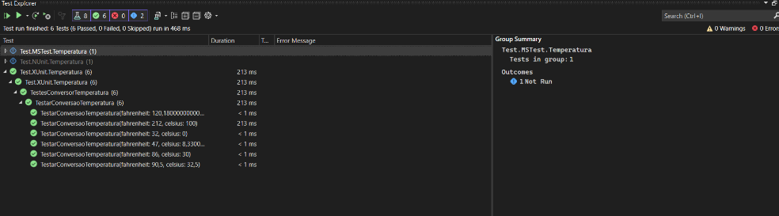
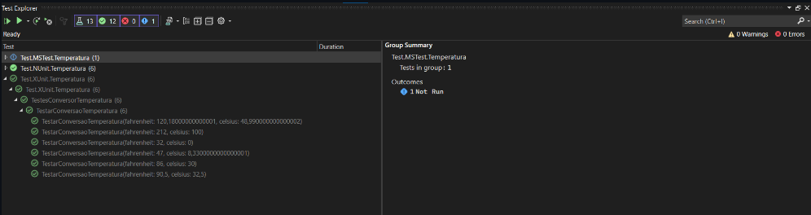
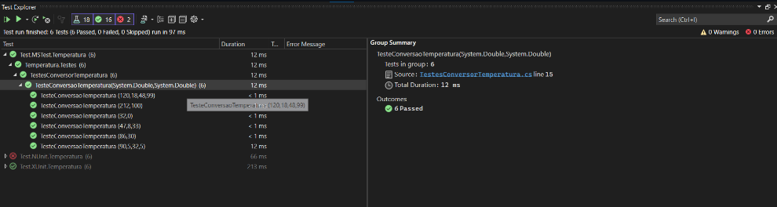

# Poderada M10S6 - Aplicando Testes

## Introdução:
Este é um documento detalhado que serve como guia para três dos frameworks de teste mais populares destinados à plataforma.NET: xUnit, NUnit e MSTest. Ele fornece uma visão completa de cada framework, seu funcionamento e benefícios exclusivos, bem como sua utilização prática em casos reais de desenvolvimento. Dessa maneira, este documento procura fornecer informações suficientes para ajudar os desenvolvedores na escolha do framework de teste mais adequado para o seu projeto C# específico, através de uma comparação útil.

## xUnit Test

### Como funciona:
xUnit.net é um framework de teste para a plataforma .NET, projetado por um dos criadores originais do NUnit. É usado para criar testes que são classes simples com métodos que o xUnit.net chama automaticamente. O xUnit usa atributos como [Fact] para testes regulares e [Theory] para testes que devem ser executados com vários dados de entrada.

### Vantagens:

* Isolamento de Testes: Cada caso de teste é executado em uma instância separada da classe de teste, proporcionando isolamento total entre testes.
* Flexibilidade com Dados de Teste: Com o uso de [Theory] e [InlineData], o xUnit permite a execução de um mesmo teste com diferentes conjuntos de dados.
* Simplicidade e Modernidade: Sua sintaxe e funcionamento são considerados mais modernos e diretos em comparação com outros frameworks.
* Suporte à Paralelização: Executa testes em paralelo por padrão, o que pode reduzir o tempo de execução dos testes.

### Execução do Teste

## nUnit Test

## Como funciona:

NUnit é um framework de testes que também suporta testes baseados em classes e métodos, utilizando atributos para identificar métodos que representam testes. Os atributos mais comuns são [Test] para testes regulares e [TestCase] para fornecer parâmetros diretamente ao método de teste.

### Vantagens:

* Parametrização Robusta: Através do atributo [TestCase], é possível passar parâmetros diretamente para os métodos de teste, facilitando a execução de múltiplas variações do mesmo teste.
* Testes em Paralelo: Suporte à execução de testes em paralelo, configurável para melhor uso de recursos e redução no tempo de execução.
* Ampla Aceitação: Sendo um dos frameworks mais antigos, possui uma grande comunidade e vasta documentação.
* Flexibilidade de Setup e Teardown: Oferece várias opções para configuração e desmontagem através de [SetUp], [TearDown], [OneTimeSetUp] e [OneTimeTearDown].

### Execução do Teste

## MSTest

### Como funciona:

MSTest é o framework de teste integrado ao ambiente de desenvolvimento do Visual Studio. Ele utiliza atributos como [TestMethod] para indicar testes e [TestClass] para classes de teste. MSTest também suporta a inicialização e limpeza de recursos através de atributos como [TestInitialize] e [TestCleanup].

### Vantagens:

* Integração com Visual Studio: Como parte do ecossistema Visual Studio, possui excelente integração com a IDE, facilitando a execução e a depuração de testes.
* Suporte da Microsoft: Como é um produto Microsoft, o suporte e a integração com outras ferramentas Microsoft são garantidos.
* Facilidade de Uso: Considerado fácil de usar, especialmente para iniciantes ou para aqueles integrados ao ambiente Visual Studio.
* Recursos de Teste Integrados: Suporta uma ampla gama de funcionalidades de teste direto no Visual Studio, como testes de carga e testes ordenados.

### Execução dos Testes

